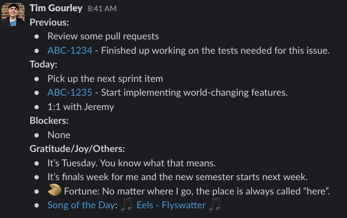

# Standup

A simple ruby script that connects to your Notion databases to generate a daily standup, suitable for Slack.



I wrote this for me, for my development team. As such, it is highly opinionated and likely won't work for your own situation. You can use this for reference or as a starting point for your own daily standup script.

## Overview

This is a program highly tailored to my development team's daily Slack standup messages. Since starting to use
Notion for taking notes, it seemed like a good fit to record my daily standup in a Notion database, then 
use a script to convert it into a format suitable for posting to Slack.

## Installation

* Clone this repository
* Ensure that you have ruby installed. This is currently using 3.2.2. If you use a tool like `rbenv`, that becomes pretty easy:

```bash
$ rbenv install 3.2.2
$ rbenv rehash
```

* Then you can install the required dependencies:

```bash
$ cd standup
$ bundle install
```

* Now you can setup your notion database.

### Notion Database Setup

This application assumes that you have two databases: A database for your daily standup, and a database for
your current song of the day. Comment or remove the code related to the song of the day if you are not interested. I leave that as an execerise for the user.

The structure of the Daily Standup database should be a regular Notion database with the following properties:

* `Item Date` (Date)
* `Name` (Title)
* `Category` (Select, with options: `Normal`, `Gratitude`, `Blocker`)
* `Completed` (Checkbox)

The structure of the Song of the Day database should be a regular Notion database with the following properties:

* `Song Title` (Title)
* `Artist` (Text)
* `URL` (URL)
* `Notes` (Text)
* `Created time` (Created time)
* `CurrentSong` (Formula)

The formula for `CurrentSong` is:

```
prop("Created time").formatDate("YYYY-MM-DD") == now().formatDate("YYYY-MM-DD")
```

You will then need to setup an integration. Currently in Notion, to do this you will click on the `My connections` link on the left sidebar, then click the link `Develop or manage integrations`. Then you can add a new internal integration for your daily standup, and jot down the API key that is generated.

After that, you will need to ensure your database have access to that integration. Go to your database, hit the `...` menu at the top-right, go to "Connect to" and choose your new integration.

You will also need the ID for each of your databases. For that, hit "Share" and then "Copy link". It should end up with something like this in your clipboard:

`https://www.notion.so/yourname/longrandomidnumberforyourdatabase&pvs=4`

Jot down the ID from this for each of your databases.

### Wire the two together

Now, you can copy the sample ENV file and fill it out:

```bash
$ cp .env.sample .env
```

Open it in your text editor, and fill out the values for the API key, database ID values, playlist information,
and your Jira info.

## Usage

After you get it set up, you can generate your formatted standup like this:

```bash
$ ruby standup.rb
```

It will output the text, and you can copy it from your terminal and paste it into Slack.

## Mustache template

Your text fields in Notion can take advantage of this application's use of [Mustache](https://github.com/mustache/mustache) for templating. For example, you can add `{{day_of_week}}` which will be replaced with the current day of the week, e.g. "Tuesday". There's also `{{fortune}}` which will use a random short wisdom fortune (if you have the fortune command installed), or one of a random array entry. Feel free to add your own tempalte replacements in the `template_variables` method.

## Todo/Ideas

Here are some items I would consider adding:

* Automatically copy the standup text to the clipboard.
* Automatically post to Slack in a pre-defined standup channel.
* Pull contents from Jira as well as Notion.